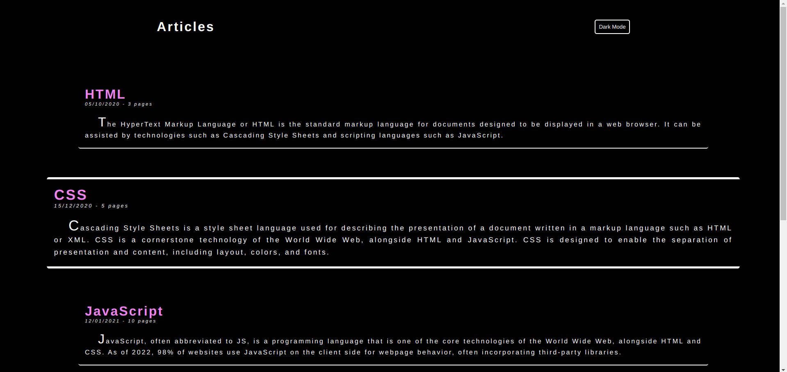
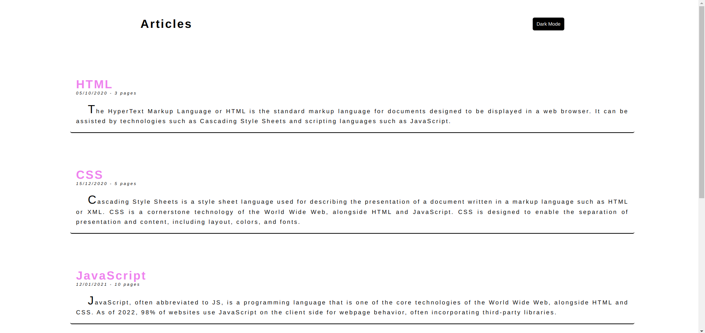

# DARK MODE PROJECT

## FULLSTACK PRACTICE PROJECT NO: 18

1. A fullstack version of my previous frontend project to practice my skills using Javascript, Jquery, NodeJS, ExpressJS, HTML, CSS.

2. There are several articles in the page.

3. When we click on the button on right top corner we can switch between dark and light modes.
